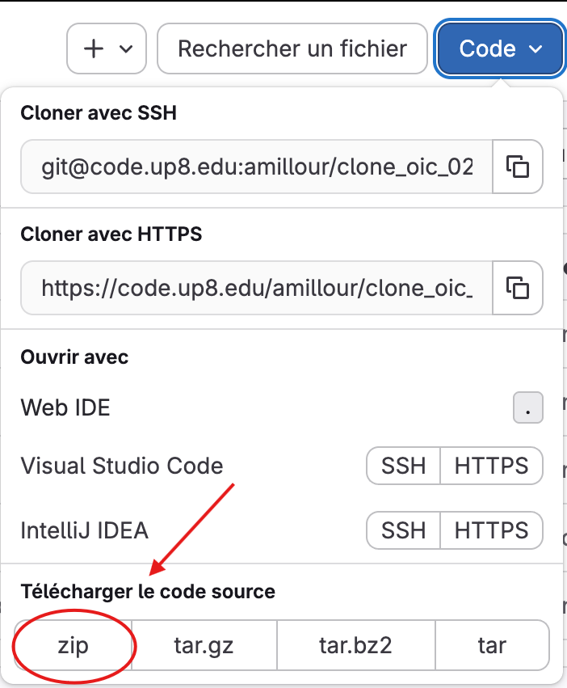

# Jeu du SUTOM

## Auteurs et Collaborateurs

### Première partie

_Développement du fonctionnement de base du jeu et de l'interface:_

- **Développement front-end:** [Sofia CETIN](https://code.up8.edu/scetin)
- **Développement back-end:** [Eliase TABBAHK](https://code.up8.edu/etabbakh)

### Deuxième partie

_Développement du solveur:_

- **À déterminer**

## Présentation du SUTOM

Le SUTOM(également connu sous son équivalent anglais Wordle), est un jeu de devinettes de mots. Le concept est simple: l'utilisateur possède 6 chances pour deviner un mot d'une longueur variable de 6 à 10 lettres. Si l'utilisateur ne devine pas le mot à l'issue de ces 6 chances, il a perdu, et inversement, il gagne.


_Une image du jeu SUTOM_

## Utilisation

### Prérequis

Ce programme Python fonctionne avec l'import Pygame. Afin de l'installer vous pouvez exécuter la commande pip suivante dans le terminal:

```bash
$pip install pygame
```

Pour plus d'informations sur ce package, vous pouvez consulter le lien officiel de la documentation.
**[Documentation Pygame](https://www.pygame.org/wiki/GettingStarted)**

Vous pouvez également configurer un environnement virtuel pour ne pas avoir à installer le package sur toute votre machine. 
**[Créer un environnement Python virtuel](https://docs.python.org/fr/3.9/library/venv.html)**

_**Attention:** Pygame ne peut pas être installé sous les versions Python 3.14+ faute de mises à jour. C'est pour cela que je vous conseille de déployer un environnement virtuel sous une autre version de Python, comme la version 3.13.9._

### Téléchargement

Une fois le package pygame installé, vous pouvez télécharger le code source du programme afin de l'exécuter, comme suit:



Vous pouvez également cloner le dépôt avec SSH ou HTTPS.

### Exécution

**Si vous souhaitez jouer:**  Vous pouvez vous positionner dans le répertoire source, et lancer avec la commande

```bash
$python3 main.py
```

**Si vous souhaitez exécuter les démos:** Vous pouvez lancer dans le répertoire source la commande, avec le fichier test désiré

```bash
$python3 tests.py < ../tests/test.txt
```

_Notez que les démos avec l'interface graphique ne sont pas disponibles et complexes à implémenter. On n'utilisera donc que l'output du terminal._

## Fonctionnalités

### Difficultés de jeu

Cette version Python du SUTOM propose trois difficultés différentes:

- **Standard**: paramètres classiques du SUTOM, les mots sont de longueur aléatoire entre 6 lettres minimum et 10 lettres maximum.
- **Intermédiaire**: seulement des mots de 8 lettres
- **Difficile**: seulement des mots de 10 lettres

Le mode initialisé par défaut est le mode **Standard**.

### Langues

Le jeu propose deux langues que vous pouvez changer dans les options: le français, initialisé par défaut lors du lancement du programme, et l'anglais.

Il est possible d'implémenter de nouvelles langues au programme, sous format JSON. Vous pouvez vous référer au menu déroulant ci-dessous si vous souhaitez davantage d'informations.

<details>

<summary><u>Comment importer ses propres langues ?</u></summary>

Le format supporté par le programme pour l'import de fichiers langues est le format [JSON](https://fr.wikipedia.org/wiki/JavaScript_Object_Notation).

Il doit respecter la notation suivante: les clés doivent être inchangées pour assurer le bon fonctionnement du programme. Elles sont en anglais par défaut et désignent un champ de texte spécifique. Voici l'exemple du fichier **fr\.json** que vous pouvez retrouver dans le dépôt:

```json
{"language" : "Langage: FR",
      "main_menu" : "Menu principal",
      "wordle" : "SUTOM",
      "play" : "Jouer",
      "options" : "Paramètres",
      "quit" : "Quitter",
      "back" : "Retour",
      "mode_default" : "Mode: Standard",
      "mode_intermediate" : "Mode: Intermédiaire",
      "mode_hard" : "Mode: Difficile",
      "win" : "Bravo !",
      "lose" : "Dommage !",
      "win_message" : "Vous avez deviné le mot du jour !",
      "daily_word" : "Le mot du jour était: ",
      "nb_of_tries" : "Nombre d'essais: ",
      "lose_message" : "Dommage !",
      "6_letter_words" : ["Chaton", "Maison",
                        "Jardin", "Souris",
                        "Poulet", "Bureau",
                        "Tomate", "Argent",
                        "Soleil", "Veloce"],
      "7_letter_words" : ["Voyages", "Chiffre",
                        "Lumiere", "Entends",
                        "Matelas", "Tableau",
                        "Cousine", "Costume",
                        "Clavier", "Etoiles"],
      "8_letter_words" : ["Papillon", "Entendre",
                        "Chocolat", "Montagne",
                        "Emporter", "Aeroport",
                        "Tortilla", "Terminal",
                        "Aventure", "Bracelet"],
      "9_letter_words" : ["Mandarine", "Rassemble",
                        "Spectacle", "Campagnes",
                        "Vengeance", "Ecrivains",
                        "Livraison", "Direction",
                        "Delicates", "Solitaire"],
      "10_letter_words" : ["Directions", "Decouverte",
                        "Fabriqueur", "Impression",
                        "Volcanique", "Basketball",
                        "Leadership", "Television",
                        "Telephones", "Confiserie"]
}
```
Une fois cette syntaxe respectée, vous pouvez insérer votre fichier dans le dossier lang, situé dans le dossier src. Le programme le prendra en compte au relancement, et vous pourrez choisir cette langue dans les paramètres.

C'est également ici que vous pourrez modifier les lexiques pour chacunes des langues implémentées(voir la prochaine section).

</details>

### Implémentation d'un lexique

Les fichiers lang incluent un lexique par défaut, composé de 10 mots pour des mots allant de 6 à 10 lettres. Vous pouvez modifier ce lexique en éditant le fichier JSON et les parties **6_letter_words**, **7_letter_words** et ainsi de suite. 

Il est important de respecter la bonne longueur des mots pour assurer le bon fonctionnement des différentes difficultés proposées par le jeu.

### Tests automatisés

Dans le fichier tests, vous pourrez trouvez les différents tests effectués avec des inputs différents pour vous montrer comment le programme parvient à gérer les cas spécifiques. Comme dit précédemment, les tests ne peuvent qu'être effectués uniquement à l'aide du fichier **tests\.py**, et l'output aura lieu dans le terminal.

Le lancement de fichiers démos est détaillé dans la section **Exécution**.


